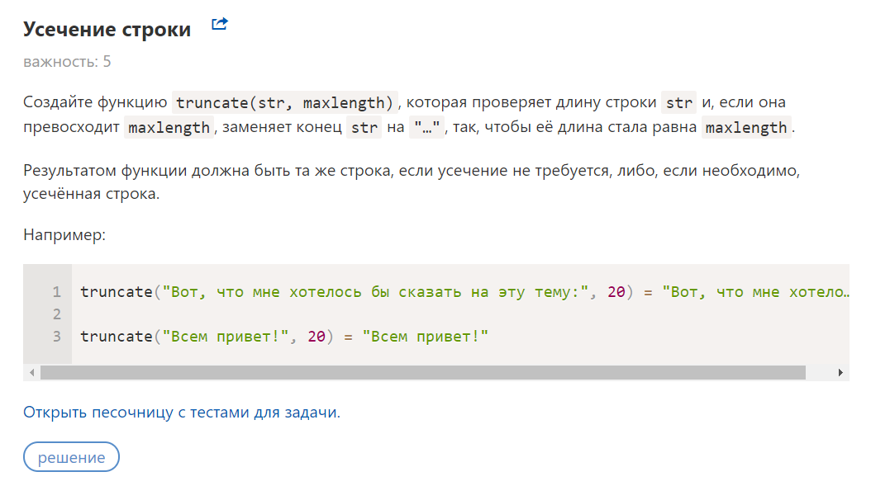
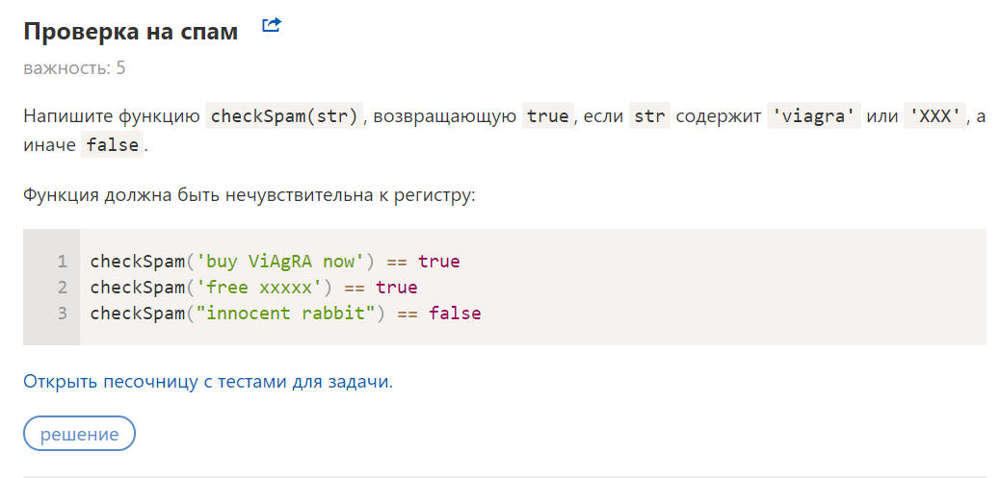

># Lesson-2 Content about

## Question's

>>### Question-1

>>### Question-2

>## About task's

* Tried to use camelCase everywhere and Conventional Commits too
* all file's and directory's had been created by terminal 
* 19 commit's
* git pull, git clone already used.
* don't read lecture.pdf in classroom. will do it don't worry :)
